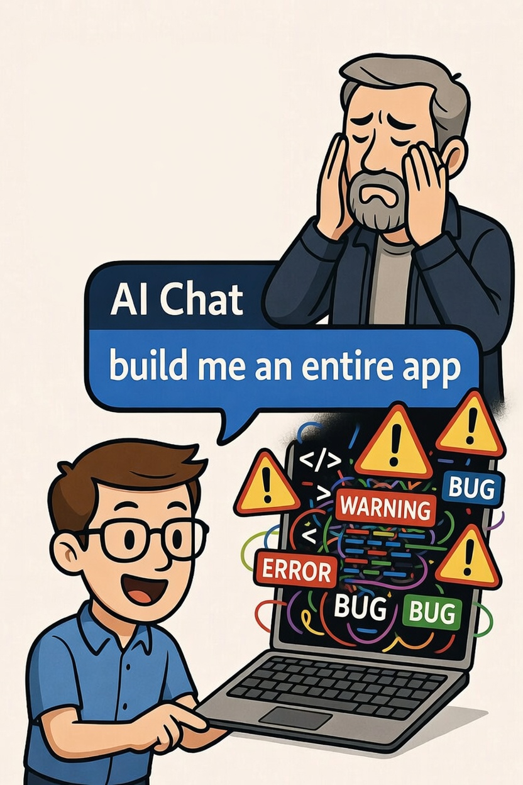
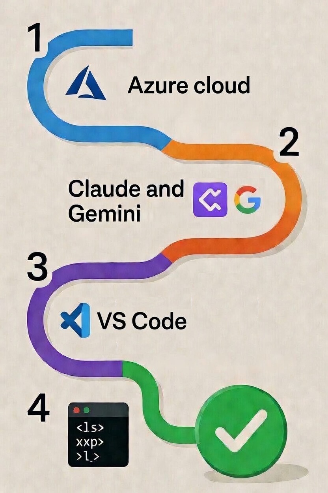
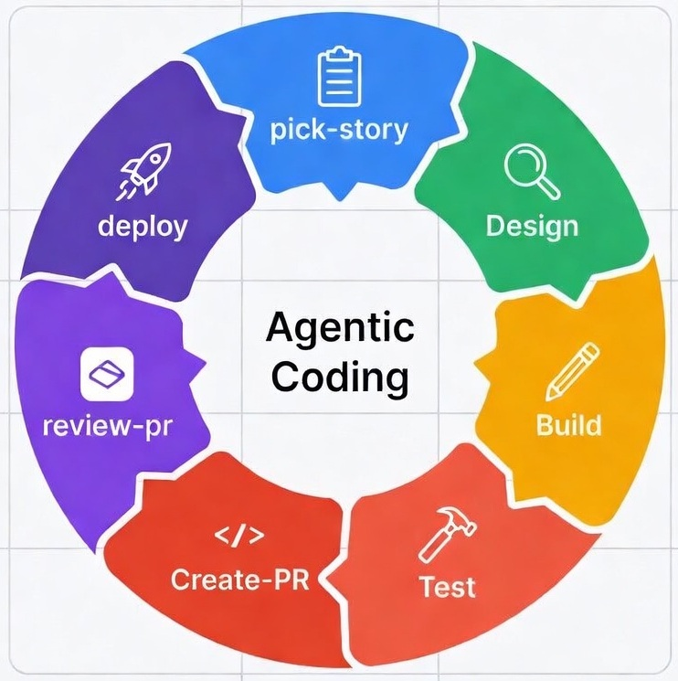
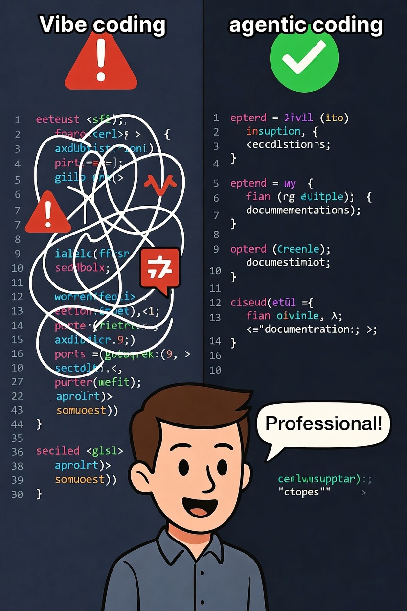

# Agentic Software Development for Enterprise-Grade Solution in 4 Simple Steps

## First, Let’s Address the Elephant in the Room: Inconsistent Quality of Vibe Coding

If you’re an experienced software architect, you’ve probably watched the AI coding hype cycle with a mixture of curiosity and professional unease. And if you’re honest, you’ve felt the specific frustration that
comes from reviewing AI-generated code that *looks* correct at a glance but, on closer inspection, cuts every corner a junior developer would be counselled for:

- Hardcoded credentials tucked into a config file
- No input validation in API because “the frontend handles it”
- A `catch (Exception e) {}` block that silently swallows errors
- SQL built by string concatenation
- Logging that dumps a JWT payload to `System.out.println`
- An `@RestController` method with no authorization annotation

This is **vibe coding** — the pattern where you describe what you want conversationally, accept whatever the LLM generates, and ship it because it compiles and the demo works. The output *feels* like engineering. It
isn’t.

The criticism from experienced engineers/architects is valid and important. LLMs are trained on the entire internet, which includes a vast amount of tutorial code, Stack Overflow snippets, and early-stage
prototypes. That code is optimized for getting to a working state quickly, not for the operational realities of production: auditability, zero-trust security, structured observability, resilience under failure,
and the long-term maintainability that comes from consistent conventions applied across a thousand files over three years.

When engineers say “I don’t trust AI-generated code,” what they’re really saying is: *“I don’t trust code generated without constraints.”* And they’re right. Unconstrained generation produces unconstrained
output.

**The answer is not to avoid agentic coding. It is to constrain it correctly.**

The good news is that we do not have to choose between speed and quality. The traditional software development lifecycle — thoughtful architecture and design, building in small, verifiable steps, writing tests, conducting rigorous reviews, and deploying through automated pipelines — has been battle-tested for decades precisely because it works. When applied to reasonably sized chunks of functionality (one user story at a time), these practices produce far higher-quality software than any zero-shot “build the app for…” prompt ever could.

The approach described in this article is built on a specific insight: **an AI agent producing code is only as good as the architectural guardrails it operates within.** Those guardrails are not optional polish — they are the entire point.

This is not Vibe Coding dressed up in enterprise clothing. It is **architecture-constrained agentic execution** — using an AI agent the same way you would use a very capable junior developer who follows
instructions precisely, never gets tired, never skips a step, and never forgets a rule, but who still needs a senior engineer to approve the design before building anything.

## Second, Let’s Build the Foundation: Agentic Coding Framework Setup for Enterprise Teams

With that framing established, here is the 4-step approach I used to set up software development framework.

**Tools used in this article are based on my personal experience and preferences and can be replaced by any equivalent tools based on individual preferences.**

The setup is simple, specialized LLM assisted tool for ‘doing’ each critical activity with automated hand-off to next specialized LLM assisted tool, with the necessary human intervention steps.

- **Agile project management**: Microsoft Azure DevOps Project for user story creation, sprint planning, progress tracking etc.
- **Primary LLM Agent**: Anthropic Claude for requirement gathering, ideation, and design, build, test, documentations etc.
- **Pair Programming partner**: Google Gemini for code reviews
- **SDLC Process Automation**: Microsoft Azure DevOps MCP Server for automating SDLC processes like user story assignment, design, build, test, review, create/review/merge PRs, deploy application etc.
- **Local IDE**: Microsoft Visual Code
- **Cloud Service Provider**: Microsoft Azure cloud services to build and deploy application

Rest of the document contains the detailed steps to setup above tools, stitch them together to start development.

### Step 1 – Microsoft Azure Setup:
#### Sign up on Azure portal (<https://portal.azure.com>)
  - Check if you eligible for $200 credits for 30 days (<https://azure.microsoft.com/en-us/pricing/purchase-options/azure-account>)
- Create Personal Access Token (PAT)
  - Sign in to Azure DevOps: Navigate to your Azure DevOps organization URL (e.g., https://dev.azure.com/{Your\_Organization}) and sign in with your credentials.
  - Go to User Settings: In the top-right corner of the page, click on your profile picture/icon and select User settings from the dropdown menu.
  - Select Personal Access Tokens: In the left navigation pane under the Security section, click on Personal access tokens.
  - Create a New Token: Click the + New Token button.
  - Configure the Token: Fill in the following details:
  - Name: Enter a descriptive name that helps you remember the token's purpose (e.g., "Agentic Coding Framework Setup").
  - Scopes: This is crucial for security. Select Custom defined scopes and grant only the minimum necessary permissions required for the task the PAT will perform.
    - Work Items (R/W), Code (R/W), Pull Requests (R/W), Build (R/Execute), Release (Read)
  - Create the Token: Click Create.
  - Copy this token and store it securely for future use.

#### Create Azure DevOps Project
  - Sign in to your organization: Go to your Azure DevOps organization URL (typically https://dev.azure.com/{Your\_Organization}) and sign in with your credentials.
  - Navigate to the Projects page: Select the Azure DevOps logo (usually in the top-left corner) to open the main Projects page.
  - Select "New project": Click the New project button. If you don't see this button, you may not have the necessary permissions.
  - Enter project details:
    - Project name: Provide a name for your project, “Agentic Coding Framework Setup”.
    - Description (optional): Enter a short description to explain the project's purpose.
    - Visibility: Choose between Public or Private. For most enterprise scenarios, private is recommended.
  - Configure advanced options:
    - Version control: Choose the initial source control type as Git.
    - Work item process: Select the process model for organizing work as Agile.
  - Create the project: Select the Create button. Azure DevOps will display the new project's welcome page upon successful creation.

### Step 2 – Anthropic Claude Setup:

- Create an Anthropic Console account by visiting the Anthropic Platform Console (<https://platform.claude.com/dashboard>) and signing up. This is a different platform from the public Claude.ai chat interface.
- Navigate to "Get API Keys" from the dashboard or the left-hand navigation menu. Claude may require you to setup payment details.
- Create a new key by clicking the "+ Create Key" button and providing a descriptive name (e.g., "Agentic Coding Framework Setup").
- Copy this key and store it securely for future use.

### Step 3 – Google Gemini Setup:

- Sign In: Go to Google AI Studio (<https://aistudio.google.com>) and sign in with a Google Account.
- Navigate to API Keys: Click "API keys" (or "Get API key") in the left sidebar.
- Create a New Key: Click the Create API key button.
- Copy this key and store it securely for future use.

### Step 4 – Local Development Machine Setup:
#### Tool Installations
  - Download and install following tools:
    - MS Visual Code (<https://code.visualstudio.com/download>)
    - Node.js (<https://nodejs.org/en/download>)
    - Python (<https://www.python.org>)
    - Azure CLI (<https://learn.microsoft.com/en-us/cli/azure/install-azure-cli?view=azure-cli-latest>)
    - Git ([https://git-scm.com/install](https://git-scm.com/install/))
    - Claude Code CLI (<https://code.claude.com/docs/en/quickstart>)
    - Google Gemini CLI (Open terminal and run command ‘*npm install -g @google/gemini-cli*’)
    - (Optional) MS Visual Code official extensions for Python, Azure, Git, Claude Code, Gemini Code etc.
  - Verify installations (Open terminal and run following commands)
    - Node.js: `node --version` and `npm --version`
    - Python: `py --version`
    - Azure CLI: `az --version`
    - Git: `git --version`
    - Claude Code CLI: `claude --version`
    - Google Gemini CLI: `gemini --version`
- Set environment variables for Azure PAT, Claude API Key, and Gemini API Key
- Clone Git repo into new local folder for the project
  - `git clone https://<organization_name>@dev.azure.com/<organization_name>/<project_name>/_git/<project\_name>`
- Authenticate Azure CLI, Claude Code CLI and Google Gemini CLI

#### Azure Setup:
  - Azure DevOps MCP Server: It gives Claude Code live, bidirectional access to your Azure DevOps organization: work items, Git repositories, pull requests, and pipeline builds. Runs as a local subprocess. PAT never leaves your machine. Register the MCP server using command
    - `claude mcp add azure-devops --env AZURE_DEVOPS_PAT=<your-PAT> -- npx -y @azure-devops/mcp <YOUR_ORG> -d core work-items repositories pipelines`
  - Create `.mcp.json` at repo root (team-shared, uses `promptString` secret for PAT — no plaintext credentials in Git).

#### Claude Setup:
  - Create CLAUDE.md with your project details, tech stack, build commands, and Architecture Review Board (ARB) rules.
  - Create .claude/commands/ with the seven slash command files (pick-story, design, build, test, create-pr, review-pr, deploy).
  - Create .claude/settings.json with hooks and the deny list for .env files.

#### Gemini Setup:
  - Create review.toml file for Google Gemini custom command for code review in .gemini/commands folder.

#### Commit everything. Every team member gets the full setup on git clone.

## Third, Let’s Review Reimagined Development Process: Iterate through seven custom commands to enable coding agents with architectural guardrails

The slash commands created in earlier section enforce the full lifecycle:
- pick-story — Pulls the next ustarted user story from the current Azure DevOps sprint and creates the feature branch.
- design — Generates professional DESIGN.md and TASKS.md documents with architecture diagrams, API contracts, database migrations, security considerations, and test strategy.
- build — Implements each task one at a time, compiling after every file change so errors are caught immediately.
- test — Writes and runs unit tests, integration tests, and coverage reports.
- create-pr — Stages changes, writes a proper Conventional Commit message, pushes the branch, and opens a beautifully documented pull request.
- review-pr — Powered by Google Gemini, this runs full engineering checklist (security, correctness, quality, performance, and conventions etc.) and posts findings directly as Azure DevOps comments.
- deploy — Merges the pull request, monitors the pipeline, verifies the rollout on Azure Kubernetes Service, runs a smoke test, and closes the work item as Done.

The result is a process that is fast, traceable, and auditable — exactly what enterprises need.

------------------------------------------------------------------------

## A Note on Enterprise Fit

Everything I’ve described is production-grade by design:

- **No secrets in Git** — PAT uses `promptString` in `.``mcp``.json`; `.env` files are deny-listed
- **Audit trail** — every work item state change, every PR comment, every commit message is traceable back to an acceptance criterion
- **Human gates** — design approval before build, commit message confirmation before push, PR review before merge
- **CI/CD sovereignty** — Claude monitors your pipeline; it doesn’t bypass it
- **Team portability** — config is in the repo, not in any individual’s machine setup

------------------------------------------------------------------------

## The Bigger Picture

We’re at an inflection point. Agentic AI in software development is not about replacing engineers — it’s about eliminating the overhead that prevents engineers from doing what they’re actually good at: reasoning
about hard problems, making architectural trade-offs, and building systems that matter.

The setup I’ve described takes a few hours to build and pays back in every sprint. The conventions are enforced, the audit trail is complete, and the cognitive overhead of coordination work drops to near zero.

If you’re running enterprise software development on Azure DevOps and want to accelerate your team without sacrificing the quality gates that matter, this is the path I’d recommend.

Happy to share the exact command files, settings templates, and CLAUDE.md structure —connect directly.

I would love to hear your thoughts in the comments.

------------------------------------------------------------------------

*\#AgenticCoding \#VibeCoding \#ClaudeCode \#AzureDevOps \#EnterpriseEngineering \#AIAssistedDevelopment \#DevOps \#SoftwareEngineering*
